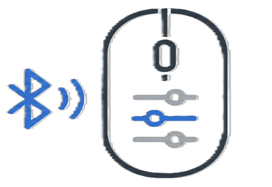

# MouseTune

<p align="center">
  
</p>

MouseTune is a portable Windows utility for inexpensive or generic Bluetooth mice that do not have their own manufacturer software. It focuses on two practical jobs:

- saving a local alias such as `Office Mouse` for a generic device reported as `BT 5.2 Mouse`;
- setting an effective DPI value that maps to persistent Windows pointer settings.

MouseTune is not a replacement for Logitech G HUB, Razer Synapse, Corsair iCUE, SteelSeries GG, or other vendor tools. It does not install drivers, run a service, use a tray process, contact the network, or require an account.

<p align="center">
  
</p>

## Current Features

- Compact .NET 8 WPF app with MVVM separation.
- Generic Bluetooth mouse discovery through Windows SetupAPI mouse interfaces.
- Duplicate HID interface grouping using Container ID, Bluetooth address, VID/PID, and fallback device identifiers.
- Local MouseTune alias that survives app and Windows restarts when the device can be matched again.
- Guarded Windows friendly-name attempt through Configuration Manager where Windows permits it.
- Effective DPI input, presets, slider, mapped Windows pointer speed preview, and Enhance pointer precision toggle.
- Verified `SystemParametersInfo` writes using `SPIF_UPDATEINIFILE` and `SPIF_SENDCHANGE`.
- Portable settings in `MouseTune.settings.json` beside the executable when writable, with `%LocalAppData%\MouseTunePortable\` fallback.
- Atomic settings writes with one backup and corrupt JSON recovery.
- Exportable local diagnostics JSON for troubleshooting device detection, saved settings, and recent MouseTune log entries.
- Self-contained single-file Windows x64 publish output named `MouseTune.exe`.

## What Effective DPI Means

Effective DPI adjusts Windows pointer sensitivity. It does not change the physical sensor inside the mouse.

Windows applies this sensitivity setting system-wide. MouseTune remembers the preferred value for the selected mouse, but the resulting Windows pointer speed can affect other standard mice.

Current mapping highlights:

| Effective DPI | Windows pointer speed |
| ---: | ---: |
| 400 | 5 / 20 |
| 800 | 10 / 20 |
| 1600 | 14 / 20 |
| 3000 | 18 / 20 |
| 6400 | 20 / 20 |

Values between anchors use interpolation and are clamped to `200-6400` effective DPI and `1-20` Windows pointer speed.

## Device Naming

MouseTune has two naming levels:

- **MouseTune alias:** saved in `MouseTune.settings.json` and shown in the app when the same mouse is detected again.
- **Windows friendly name:** attempted through documented Windows device APIs where Windows and the device driver permit it.

MouseTune changes the name displayed by this Windows computer where Windows permits it. It does not rewrite the Bluetooth name stored in the mouse firmware. Some Bluetooth devices reject local friendly-name writes; in that case the MouseTune alias is still saved and shown inside the app.

## Portable Files

When the executable folder is writable, MouseTune stores local files beside `MouseTune.exe`:

```text
MouseTune.exe
MouseTune.settings.json
MouseTune.settings.json.bak
MouseTune.log
MouseTune.diagnostics-*.json
```

If the executable folder is not writable, MouseTune falls back to:

```text
%LocalAppData%\MouseTunePortable\
```

## Build Requirements

- Windows 10/11
- .NET 8 SDK

## Development Commands

```powershell
dotnet restore
dotnet build MouseTune.sln
dotnet test MouseTune.sln
dotnet run --project src/MouseTune.App
```

## Portable Publish

Default portable release, self-contained single file:

```powershell
dotnet publish src/MouseTune.App `
  -c Release `
  -r win-x64 `
  --self-contained true `
  -p:PublishSingleFile=true `
  -p:IncludeNativeLibrariesForSelfExtract=true
```

Smaller framework-dependent single file:

```powershell
dotnet publish src/MouseTune.App `
  -c Release `
  -r win-x64 `
  --self-contained false `
  -p:PublishSingleFile=true
```

The expected primary output is:

```text
src/MouseTune.App/bin/Release/net8.0-windows/win-x64/publish/MouseTune.exe
```

## Project Layout

```text
MouseTune.sln
src/MouseTune.App/
  Models/
  ViewModels/
  Services/
  Native/
  Themes/
  images/
tests/MouseTune.Tests/
docs/
```

Native Windows interop is isolated under `src/MouseTune.App/Native/`. App behavior is coordinated by services and `MainViewModel`; code-behind is kept minimal.

## Validation Status

Automated validation currently covers DPI mapping, clamping, settings persistence and recovery, diagnostics export, device identity matching, deduplication, alias validation, and pointer setting read-back verification.

Latest local validation:

```powershell
dotnet build MouseTune.sln
dotnet test MouseTune.sln
dotnet publish src/MouseTune.App -c Release -r win-x64 --self-contained true -p:PublishSingleFile=true -p:IncludeNativeLibrariesForSelfExtract=true
```

Manual validation is still required on a Windows machine with the target generic Bluetooth mouse for rename behavior, reconnect behavior, and restart persistence.

## Roadmap

Good next improvements:

- Capture parent Bluetooth device identity metadata to improve matching after reconnects.
- Refresh devices automatically when Windows sends device-change notifications.
- Add a visible "Reapply Windows name" action when Windows reports the original name but MouseTune has a saved alias.
- Add system/light/dark theme switching using the existing theme dictionaries.
- Add a single-instance guard so opening `MouseTune.exe` twice focuses the existing window.
- Improve diagnostics with a copy-to-clipboard summary for support reports.
- Add optional same-exe elevated rename mode only if real device testing proves it is needed.

Out of scope for the portable version: vendor software integration, hardware DPI claims for generic mice, RGB, macros, polling-rate control, firmware updates, startup tasks, tray mode, services, telemetry, accounts, and cloud sync.
